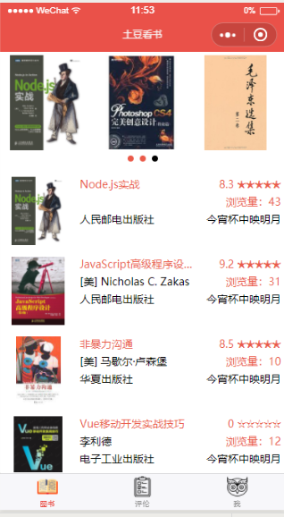
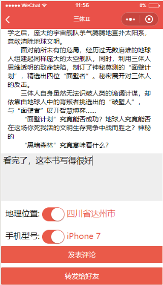
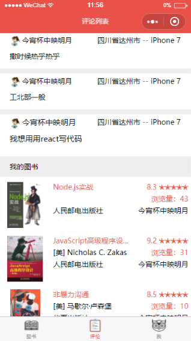
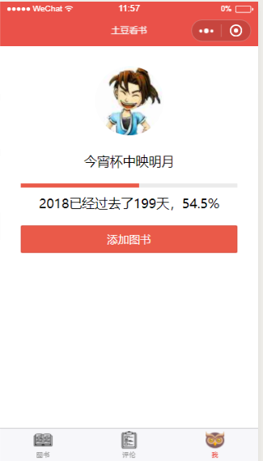

# potato_book(土豆读书)

> 一款基于mpvue开发的小程序

## 使用方式

``` bash
# 依赖安装
npm install

# 本地启动
npm run dev

# 打包成小程序
npm run build

# build for production and view the bundle analyzer report
npm run build --report
```

## APP展示
  
  
  
  
  
  
